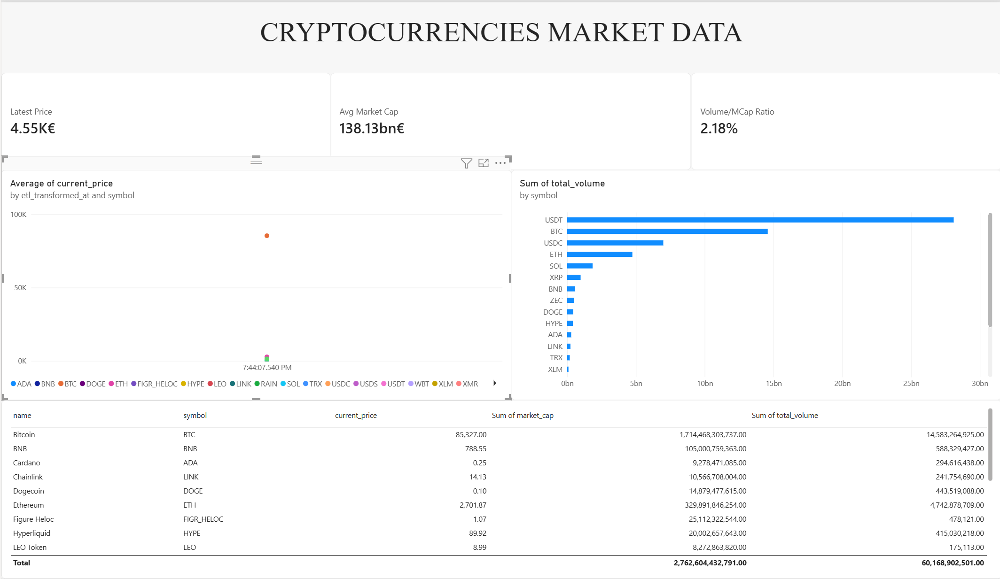

# Fintech Crypto Market ETL Pipeline

A production-grade, containerized Airflow ETL pipeline designed for fintech analytics. This system extracts live cryptocurrency market data, performs rigorous data sanitization, validates structural and financial constraints, and loads clean records into a relational database.

---

## 🏗️ Architecture & Workflow

The pipeline runs as an orchestrated Directed Acyclic Graph (DAG) with the following stages:

1. **Extract (`extract_market_data`)**: Pulls current market metrics (prices, volumes, market caps) via public APIs (e.g., CoinGecko).
2. **Transform (`transform_market_data`)**: Normalizes tickers, handles null/missing values, parses timestamps, and injects corporate auditing metadata (`etl_transformed_at`).
3. **Data Quality Gate (`run_data_quality_validations`)**: Evaluates records against strict assertions (primary key existence, negative price checks) to prevent corrupted data from hitting production tables.
4. **Load (`load_market_data`)**: Persists the clean, validated dataset into PostgreSQL.

---

## 🛠️ Tech Stack

* **Orchestration**: Apache Airflow (TaskFlow API decorators)
* **Data Processing**: Pandas, NumPy
* **Database**: PostgreSQL (via SQLAlchemy / Airflow Hooks)
* **Language**: Python 3.10+
* **Environment**: Containerized execution environment

---

## 📂 Project Structure

```text
fintech_crypto_market_etl/
│
├── dags/
│   └── crypto_market_dag.py        # Main Airflow DAG definition & failure alerts
├── include/
│   ├── extract.py                  # API extraction logic
│   ├── transform.py                # Data cleaning & type enforcement
│   ├── data_quality.py             # Validation checks & assertions
│   └── load.py                     # Database loading module
├── logs/                           # Airflow task execution logs
└── README.md
```

## ⚙️ Configuration & Setup

1. **Clone the repository:

```Bash
git clone [https://github.com/your-username/fintech-crypto-market-etl.git](https://github.com/your-username/fintech-crypto-market-etl.git)
cd fintech-crypto-market-etl
```

2. **Configure Environment Variables:

Ensure your Airflow instance has the necessary database connections configured (e.g., postgres_default).

2. **Directory Path Resolution:

The DAG automatically appends the include/ directory to sys.path to ensure seamless module imports inside the container:

```Python
sys.path.insert(0, os.path.abspath(os.path.join(os.path.dirname(__file__), '../include')))
```

## 🚨 Production Error Handling & Monitoring

- **Failure Alerts: Features a custom on_failure_callback hook (task_failure_alert_callback) designed to log error payloads and integrate with alerting webhooks (such as Slack or PagerDuty).

- **XCom Serialization Safe: Timestamps are explicitly converted to ISO-format strings before returning from transformation tasks to prevent JSON serialization errors (TypeError: Object of type Timestamp is not JSON serializable).

---

## 📊 Power BI Dashboard Setup

The project includes a pre-configured Power BI report to visualize real-time trends, market capitalization distributions, and volume-to-market-cap ratios.

### Prerequisites
* **Power BI Desktop** installed on your machine.
* A running **PostgreSQL** instance populated by the Airflow ETL pipeline.

### Connecting the Dashboard
1. Open the Power BI report file located in the `dashboard/` directory.
2. When prompted (or via **Transform Data** > **Data source settings**), update your database connection parameters:
   * **Server:** `localhost:5432` (or your container host)
   * **Database:** Your PostgreSQL warehouse name
3. Click **Refresh** to sync the model with your local tables (`dim_crypto` and `fact_crypto_market`).

## 📊 BI Dashboard Preview

